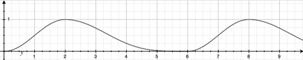

# BreathingLight v1.0.0

It's a utils for setting a breathing light of views.

## Usage
#### Step 1

It's very easy:

```Android
// start
BreathingLight.setBreathing(findViewById(R.id.any_view));
// stop
BreathingLight.stopBreathing(findViewById(R.id.any_view));
```

all right

## key




### Customization

Temporarily not.

## THANKS
